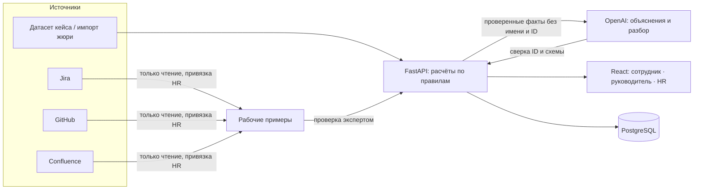

# Career Quest

AI-навигатор развития сотрудника — проект команды **AI-SECO** для **HackAlem AI**, кейс Halyk Bank.

**Статус:** рабочая локальная версия с тремя ролями — сотрудник, HR и руководитель своего отдела. Реализованы маршрут развития с объяснимыми рекомендациями, AI-объяснения и AI-разбор для разговора, очередь поддержки и «Готовы к росту», причины отсутствия шага, участие по активностям, онбординг и первичная оценка, повторная аттестация, редактор курсов и тестов, награды с одобрением HR, планы и паузы, рабочие примеры GitHub/Jira/Confluence с проверкой экспертом, импорт данных жюри и запуск одной командой. Качество AI проверяется отдельно от формата. [Текущее состояние и очередь работ](docs/IMPLEMENTATION_PLAN.md).

## Идея продукта

### Проблема

Обучение, аттестации, менторство и назначения приходят сотруднику разрозненными уведомлениями. Он не видит, как конкретный курс приближает его к следующей роли, поэтому обязательное проходит формально, а добровольное — редко. Руководитель и HR не видят целостной картины: у кого развитие остановилось, какие компетенции проседают и где каталог обучения просто не закрывает потребность.

### Решение

Career Quest — AI-навигатор развития, который отвечает на один практический вопрос: **«Что мне разумно сделать дальше, чтобы приблизиться к моей цели?»** Это не очередной каталог курсов и не абстрактный «AI-коуч», а маршрут: где человек сейчас, чего не хватает до цели и какие 1–3 шага помогут больше всего — с понятным объяснением почему.

### Откуда данные

| Источник | Что даёт | Кому |
| --- | --- | --- |
| Датасет кейса (профили, матрица навыков, каталог, история) | Текущие навыки, требования роли и грейда, доступное обучение, что человек уже проходил и пропускал | Всем сотрудникам |
| Jira | Задачи, оценки времени, ворклоги, критерии приёмки — контекст реальной работы | Всем, чьи задачи ведутся в Jira |
| GitHub | Pull requests и замечания ревью по критериям навыков | Только тем, у кого есть GitHub-аккаунт; без аккаунта оценка не снижается |
| Confluence | Страницы и комментарии к ним (сноски и встроенные) | Тем, кто документирует решения |

Рабочие системы подключает HR только на чтение, аккаунты привязываются к сотрудникам с подтверждением HR. В демо — синтетические данные и тестовые проекты; реальные персональные данные не используются.

### Что получает каждая роль

| Роль | Что видит и делает |
| --- | --- |
| **Сотрудник** | Цель от HR, готовность к ней, матрица навыков, 1–3 шага с объяснением и AI-пояснением, «Моё обучение», тесты по курсам, заявки о завершении, рабочие примеры, награды. Видит только себя |
| **Руководитель** | Сводку и очередь поддержки своего отдела, профили сотрудников отдела и AI-разбор для разговора. Только чтение: цели, оценки и планы меняет HR |
| **HR** | Всю компанию: очередь поддержки и «Готовы к росту», причины отсутствия шага, частые разрывы, участие по активностям, онбординг и оценки, планы и паузы, каталог курсов и тестов, награды, интеграции и проверку рабочих примеров |

### Как это работает

1. **Текущие навыки.** Последняя оценка плюс завершённое после неё обучение по правилу `max(cur, min(cur + gain, max_level))`, без повторного начисления. Подтверждённая повторная аттестация становится новой базой; исходная оценка не перезаписывается.
2. **Разрывы до цели.** Цель назначает HR после разговора с сотрудником; по требованиям целевой роли и грейда видно, какие навыки не дотягивают и какие из них критичны для перехода.
3. **Подбор шагов — код, а не модель.** Только добровольные мероприятия для своей роли и грейда, с выполненными предпосылками и ближайшей сессией, не пройденные ранее. Балл учитывает закрываемый разрыв (критичный навык весит втрое), трудозатраты, пропуски этого и похожих мероприятий и подтверждённые экспертом зоны развития из рабочих примеров. Поэтому самый низкий навык не всегда первый шаг: если человек трижды пропустил клуб выступлений, а для Senior критичен System Design, система выберет курс по System Design и объяснит почему.
4. **AI объясняет, но не решает.** Модель получает только проверенные факты без имени и ID и пишет понятное объяснение. Мероприятие вне списка кандидатов отклоняется, а при ошибке или таймауте остаётся расчёт по правилам.
5. **Прогресс.** Сотрудник сообщает о завершении или сдаёт тест — HR подтверждает — уровни пересчитываются, а пройденный курс больше не рекомендуется.
6. **Сигналы для HR.** Очередь поддержки (высокий / средний / плановый приоритет с причинами, паузами и датами встреч), «Готовы к росту», причина отсутствия шага у каждого сотрудника и участие по активностям. Это повод для разговора, а не оценка человека.

### Где работает AI

| Где | Что делает | Ограничения |
| --- | --- | --- |
| Рекомендации сотрудника | Объясняет каждый шаг: связь с целью, прирост, трудозатраты, историю | Только выбранные сервером кандидаты; ID сверяются |
| Карточка у HR и руководителя | «Как начать разговор»: вывод, вопросы, шаг на 2 недели | Без имени, ID, отдела и заметок; учитывает даты сессий |
| Рабочие примеры | Формулирует наблюдения и предлагает критерий для замечания ревью | Вывод подтверждает эксперт; уровни навыков не меняются |
| Редактор курсов | Предлагает описание и вопросы теста | Только черновик; публикует человек после проверки вторым HR |

Качество проверяется скриптом `backend/evals/ai_quality.py` раздельно по формату, фактам и безопасности; последний прогон — 9 из 9 ответов без расхождений, задержка p50 4,5 с и p95 7,4 с при лимите ТЗ 10 с.

### Что уже видно на данных кейса

- **Очередь поддержки:** высокий приоритет — 33 сотрудника, средний — 106, плановый — 61.
- **Нет рекомендованного шага у 92 из 200.** У 66 HR ещё не назначил цель, у 22 подходящее обучение уже пройдено, у 3 мешают предпосылки, у 1 в каталоге нет курсов по разрывам.
- **Готов к разговору о переходе 1 человек** по формуле роста.
- **Каталог — узкое место:** у многих, особенно у Lead, нет подходящих мероприятий, а курс даёт +1 уровень один раз. Система это честно показывает и подсказывает, где нужны ментор, практика, переоценка или новый курс в каталоге.

### Принципы

- Развитие добровольное; обязательные процессы не дают баллов и наград.
- Никаких публичных рейтингов: очереди видят только HR и руководитель своего отдела, у каждого сигнала есть причина.
- Никаких ярлыков о мотивации, лени или здоровье; пропуски — повод уточнить формат и нагрузку.
- Решения за людьми: цель ставит HR, курсы публикует после проверки второй HR, аттестацию подтверждает второй HR, награду выдаёт HR.
- Честность данных: если шага нет — объясняем почему, а не выдумываем курс.

### Чем отличается от обычного каталога

Каталог отвечает на вопрос «какие курсы у нас есть». Career Quest отвечает на вопрос «какой шаг нужен именно мне» — с учётом цели, критичности навыков, истории участия и реальной работы — и даёт HR картину, где развитие буксует и почему.

## Приложение и макет команды

В репозитории объединены рабочее приложение и материалы ветки `docs/analytics-and-plan`. Полезные идеи макета перенесены в приложение поверх серверного API; исходный макет сохранён отдельно:

| Вариант | Что доступно | Где находится |
| --- | --- | --- |
| Рабочее приложение | Сервер, база данных, три роли, отдел руководителя, очередь поддержки, планы, обучение, первичная оценка, цель только от HR, рекомендации и подтверждения | `backend/`, `frontend/`; запуск на порту 8000 |
| Интерактивный макет напарника | Три кабинета: сотрудник, HR и руководитель отдела; демонстрационные GitHub/Jira и очередь поддержки | [Макет и инструкция](mockups/career-quest/README.md); отдельный запуск на порту 8765 |

В приложении права руководителя ограничены явно назначенным на сервере отделом; без назначения доступ закрыт. В исходном макете переключение ролей не защищает данные. В приложении GitHub, Jira Cloud и Confluence Cloud подключаются только на чтение для тестовых проектов (раздел «Интеграции»); в макете интеграции демонстрационные. Используйте только синтетические данные.

Материалы напарника: [описание продукта и трёх ролей](docs/PRODUCT_OVERVIEW.md), [аналитика датасета и ранний план](Career_Quest_аналитика_и_план.md). Ранний план содержит предложения; актуальные правила приложения описаны в этом README и [сценарии демо](docs/DEMO.md).

## Быстрый запуск

Для установки с нуля на компьютер или сервер используйте [обязательную инструкцию деплоя](#инструкция-деплоя-обязательная).

Нужен Docker Desktop. Синтетический датасет организаторов теперь включён в `mockups/career-quest/data`: `employees.json`, `skills.json`, `events.json`, `activity_history.csv`. При первом запуске создайте `.env` по образцу `.env.example` и задайте `DATASET_PATH=./mockups/career-quest/data`. По умолчанию конфигурация по-прежнему ожидает внешнюю папку `../materials/career_quest_dataset`. Если приложение уже работает с этой папкой, менять настройку или сбрасывать базу не нужно. Существующий `.env` и API-ключ не перезаписывайте.

```sh
docker compose up --build -d
```

Откройте [Career Quest](http://localhost:8000). API-документация: [Swagger](http://localhost:8000/docs). Контейнер сам ждёт PostgreSQL, применяет миграции и один раз загружает датасет. Повторный запуск не сбрасывает данные. Остановить без удаления базы: `docker compose stop`.

Выберите «Сотрудник», «HR-партнёр» или «Руководитель». Начальный пароль демо-аккаунтов: `careerquest-demo`. Логины: `employee`, `hr`, `expert` (второй HR для проверок курсов и аттестаций), `manager`; сотрудник привязан к `E0002`, руководителю назначен Backend Development. Руководитель только читает данные своего отдела, не меняет цели, планы, оценки и завершения. HR может выбрать «Создать отдельный вход сотруднику» при добавлении нового профиля: логин и случайный пароль показываются один раз. Для входа выберите «Сотрудник» и введите выданные данные. Без этой опции новый профиль доступен только HR. `DEMO_PASSWORD` применяется при создании демо-аккаунтов, а не меняет существующие пароли. При обновлении базы отсутствующий демо-аккаунт `manager` создаётся без сброса данных; существующий доступ не расширяется.

Карьерную цель задаёт и меняет только HR в карточке сотрудника. Сотрудник просматривает цель и рекомендации, но не может изменить или удалить цель — ни в интерфейсе, ни напрямую через API. Назначение цели не меняет текущую должность, грейд или оценки навыков. Межпрофессиональное направление может назначить HR; отдельного автоматического перевода на другую должность нет.

**Только локальное демо:** порт привязан к `127.0.0.1`. Не публикуйте этот Compose в интернет: здесь нет корпоративного SSO, управления аккаунтами, HTTPS, защиты входа от перебора и производственной политики хранения. JWT хранится в HttpOnly/SameSite cookie, права проверяются сервером; случайный ключ подписи пересоздаётся при перезапуске процесса (нужно войти заново). Используйте только синтетические данные.

## Инструкция деплоя (обязательная)

Инструкция разворачивает **полное приложение** — React-интерфейс, FastAPI и PostgreSQL, а не отдельный HTML-макет. Поддерживаемый сценарий этой версии: локальное демо или закрытое демо на Linux-сервере через SSH-туннель. Публичный production-деплой требует доработок безопасности, перечисленных ниже.

### 1. Подготовить окружение

Нужны Git и работающий Docker с командой `docker compose`: Docker Desktop на macOS/Windows или Docker Engine с Compose plugin на Linux. На Windows команды ниже выполняйте в WSL2/Bash. Отдельно устанавливать Python, Node.js и PostgreSQL не требуется — сборка выполняется внутри контейнеров. Для первой сборки нужен интернет для загрузки образов и зависимостей.

```sh
git --version
docker version
docker compose version
```

Все следующие команды, кроме подключения по SSH, выполняются **в корне репозитория**, рядом с `compose.yml`.

### 2. Скачать проект

```sh
git clone https://github.com/BAITC-Hacks/hack-1518be83-ai-seco.git
cd hack-1518be83-ai-seco
```

Если репозиторий закрыт, предварительно получите доступ команды и настройте авторизацию GitHub. Не вставляйте токен в URL клонирования или в README.

### 3. Создать конфигурацию

Для **новой установки** скопируйте шаблон (ключ `-n` не перезаписывает существующий файл):

```sh
cp -n .env.example .env
```

Откройте `.env` в редакторе. Обязательно укажите встроенный датасет: значение `DATASET_PATH` в шаблоне рассчитано на внешнюю папку разработчика. Для новой копии репозитория минимальная конфигурация выглядит так:

```dotenv
DATASET_PATH=./mockups/career-quest/data
DEMO_PASSWORD=careerquest-demo
AI_ENABLED=false
OPENAI_API_KEY=
OPENAI_MODEL=gpt-6-sol
```

В указанной папке уже есть четыре обязательных файла: `employees.json`, `skills.json`, `events.json`, `activity_history.csv`. Они монтируются только для чтения. Схему и названия файлов менять не нужно.

Без API-ключа доступны профили, импорт, рекомендации по правилам, HR и кабинет руководителя. Для AI настройте локальные переменные по разделу [«Включение OpenAI»](#включение-openai). Сам `.env` не публикуйте: он исключён из Git и Docker-контекста. Не выводите полную конфигурацию с секретами в отчёты или скриншоты.

`DEMO_PASSWORD` применяется только при создании демо-аккаунтов, а не меняет пароль в существующей базе. Подключение app к PostgreSQL уже задано в `compose.yml`; править `DATABASE_URL` для этого сценария не требуется. Известные пароли и пароль БД допустимы только в закрытом демо на синтетических данных.

### 4. Собрать и запустить

```sh
docker compose config -q
docker compose up --build -d --wait --wait-timeout 180
```

Первая команда проверяет конфигурацию без вывода секретов. Вторая собирает интерфейс и сервер, запускает базу и ждёт готовности сервисов. Контейнер app автоматически применяет миграции и загружает стартовый набор в пустую базу. Если Compose не знает `--wait`, обновите Compose plugin или используйте `docker compose up --build -d` и проверьте готовность следующим шагом.

### 5. Проверить развёртывание

```sh
docker compose ps
curl --fail --silent --show-error http://127.0.0.1:8000/api/health
```

У `db` и `app` ожидается статус `healthy`, ответ проверки — `{"status":"ok"}`. Этот запрос также проверяет доступность базы и загруженного каталога. Откройте [приложение](http://127.0.0.1:8000/) и [описание API](http://127.0.0.1:8000/docs).

Проверочные входы при стандартном `DEMO_PASSWORD`:

| Кнопка входа | Логин | Пароль | Ожидаемый результат |
| --- | --- | --- | --- |
| Сотрудник | `employee` | `careerquest-demo` | Профиль `E0002`, цель и рекомендации |
| HR-партнёр | `hr` | `careerquest-demo` | Общая сводка и управление развитием |
| Руководитель | `manager` | `careerquest-demo` | Только отдел Backend Development |

Успешная проверка: вход работает, профиль и сводка загружаются, сотрудник не может менять цель. AI проверяйте отдельно кнопкой «Объяснить с AI» после подключения ключа; это платный запрос, обычный запуск его не делает.

### 6. Развернуть закрытое демо на VPS

Подключитесь к своему Linux-серверу по SSH и выполните на нём шаги 1–5. На сервере приложение остаётся привязано к `127.0.0.1:8000`, PostgreSQL не публикует порт на хост. **Не открывайте порты 8000 и 5432 в интернет и не меняйте привязку на `0.0.0.0`.**

На своём компьютере откройте отдельный терминал; замените `deploy` и `SERVER_IP` реальными SSH-логином и адресом сервера:

```sh
ssh -N -L 18000:127.0.0.1:8000 deploy@SERVER_IP
```

Пока соединение открыто, демо доступно на компьютере по адресу [http://127.0.0.1:18000](http://127.0.0.1:18000/). Другому участнику нужен собственный разрешённый SSH-доступ и такой же туннель. Это не публичная ссылка для жюри.

Публичный URL — отдельный этап: HTTPS/reverse proxy, безопасные cookie и постоянный секрет подписи, замена демо-авторизации и паролей, защита входа, управление доступом, резервные копии и правила хранения данных. Текущий Compose нельзя считать готовым production-развёртыванием.

### Обновление и сохранность данных

Данные PostgreSQL хранятся в именованном томе `quest-db` (обычно `career-quest_quest-db`). Остановка и пересборка app не очищают базу; повторный seed не перезаписывает загруженный каталог. Изменение файлов датасета или `DATASET_PATH` само по себе не обновляет существующую базу — новые профили и историю загружайте через импорт HR.

Перед обновлением сделайте резервную копию. Команда ниже сохраняет её **рядом с папкой репозитория**, с временной меткой; проверьте успешное завершение и храните файл в защищённом месте:

```sh
backup_file="../career-quest-backup-$(date +%Y%m%d-%H%M%S).dump"
docker compose exec -T db pg_dump -U quest -d quest -Fc > "$backup_file"
test -s "$backup_file"
```

Затем, если в `git status --short` нет несохранённых изменений:

```sh
git status --short
git switch main
git pull --ff-only origin main
docker compose up --build -d --wait --wait-timeout 180
curl --fail --silent --show-error http://127.0.0.1:8000/api/health
```

При конфликте или расхождении веток остановитесь и согласуйте изменения; не используйте принудительный сброс. После перезапуска сервера войдите заново — демо-секрет сессий пересоздаётся. Не запускайте несколько копий app с этим режимом авторизации. Восстановление из копии и откат миграций сначала проверяйте на отдельной базе; не затирайте рабочий том ради демонстрации.

Остановка без удаления данных: `docker compose stop`. Повторный запуск: `docker compose up -d --wait --wait-timeout 180`. **Не используйте `docker compose down -v` и очистку Docker volumes: они могут удалить базу.**

### Если запуск не удался

```sh
docker compose ps
docker compose logs --tail=100 app db
```

| Симптом | Что проверить |
| --- | --- |
| Docker недоступен | Запущен ли Docker Desktop/daemon, есть ли доступ к нему |
| Не найдены файлы датасета | `DATASET_PATH=./mockups/career-quest/data`, наличие всех четырёх файлов и доступ Docker к папке |
| Порт 8000 занят | Остановить другую копию приложения либо выбрать свободный локальный порт; не открывать сервис наружу |
| app не стал healthy | Логи миграций/seed, готовность db, путь к данным; не удалять том для устранения ошибки |
| После обновления вход сброшен | Войти заново; изменение `DEMO_PASSWORD` не сбрасывает существующие пароли |
| AI не отвечает, но профиль работает | Проверить локальные настройки AI и перезапустить app; до исправления остаётся явно обозначенный режим правил |

Перед передачей логов удалите секреты и личные сведения. Содержимое `.env` и полный вывод `docker compose config` не отправляйте.

## Работа с приложением

### Новый сотрудник: от профиля к обучению

1. Войдите как HR → «Сотрудник». Заполните ID, имя, подразделение, профессию, грейд, дату найма, формат и язык. Специализация (например, Java / Spring), руководитель и дата начала текущего грейда необязательны. Неизвестную дату грейда оставьте пустой.
2. При необходимости включите создание входа и безопасно сохраните показанный пароль. В базе хранится только Argon2-хеш; пароль не возвращается в профиле и не попадает в журнал действий. Сброс, смена пароля и управление доступом после создания пока отсутствуют; это не production-авторизация.
3. Нажмите «К первичной оценке» → «Провести первичную оценку». HR записывает результаты уже проведённого интервью/практики: дату, способ, уровни 0–5, основания по каждому оценённому навыку и итог. Неоценённые навыки оставьте пустыми. LLM не выставляет оценки; встроенного проведения теста пока нет.
4. После сохранения задайте цель в профиле. Появятся допустимые обучения, помогающие закрыть подтверждённые разрывы. Для новых профилей неизвестные навыки не используются как причина рекомендации; общий процент показывается только когда оценены все навыки цели. Частичная оценка явно обозначается.

Первичная оценка сохраняется с автором и датой. Повторным запросом нельзя переписать её или исходные оценки импортированных сотрудников. Существующий импорт JSON/CSV работает без изменения схемы. Расширенные поля и оценка хранятся отдельными документами в базе. У нового профиля до оценки `last_review_date` технически равен дате найма для совместимости со схемой, но статус `pending_assessment` явно блокирует цель, рекомендации и завершения: это не выданная оценка.

Специализация сохраняется как контекст, но не создаёт новую матрицу компетенций. Матрицы и шкала остаются из каталога организаторов; для дополнительных навыков есть «Показать навыки всего каталога». В карточке HR можно уточнить подтверждённую дату начала текущего грейда, в том числе для импортированного профиля. Сохраняются основание, автор и история уточнений. Это не повышение и не полная история переходов между грейдами.

### Включение OpenAI

Ссылка на участников организации не является API-ключом. Создайте ключ нужного OpenAI-проекта и локально заполните `.env` по `.env.example`: `OPENAI_API_KEY`, `AI_ENABLED=true`, `OPENAI_MODEL=gpt-6-sol`. Ключ не отправляйте в чат и не коммитьте. Затем выполните `docker compose up -d --force-recreate app`.

Для команды с выданными API-кредитами:

1. Выберите организацию, которой начислены кредиты. Страница **People** управляет участниками и правами; наличие доступа к ней не подтверждает баланс. Проверьте кредиты в Billing и назначение в нужный проект.
2. Используйте выделенный проект **Career Quest**. Если его нет или не хватает прав, попросите владельца организации создать проект и добавить команду с минимально необходимыми правами. Не нужен общий Admin API key и не нужно выдавать всем роль Owner.
3. В разделе **API keys** выбранного проекта создайте серверный ключ и сохраните его только в локальном `.env`. В браузерный код ключ не передаётся. Текущая модель в конфигурации — стартовый выбор, её доступность в вашей организации ещё нужно проверить.
4. Для первых тестов рекомендуем **Limits → Spend → Edit spend limit → $5/month → Enforce a hard limit** и уведомление до достижения порога. Это отдельная настройка: обычное уведомление не останавливает запросы. Жёсткий лимит применяется не мгновенно, поэтому возможно небольшое превышение. Настройка требует соответствующих прав.
5. После перезапуска app нажмите «Объяснить с AI» на синтетическом профиле. Проверьте ответ и фактический расход в Usage; при ошибке интерфейс останется в режиме правил. До первого успешного запроса подключение не считаем проверенным.

Инструкция сверена с OpenAI Docs: [права команды](https://developers.openai.com/api/docs/guides/rbac), [API-ключ](https://developers.openai.com/api/docs/quickstart), [лимиты расходов](https://developers.openai.com/api/docs/guides/spend-limits). Баланс и права конкретной организации автоматически не проверялись.

AI вызывается только кнопкой «Объяснить с AI», а не при открытии профиля. Сервер сначала выбирает допустимые курсы, модель объясняет их; числовые оценки и права не передаются модели на усмотрение. В запросе нет имени, ID сотрудника и сырых рабочих документов. Ответ ограничен схемой; идентификаторы сверяются с кандидатами. Включены `store=false`, кэш по фактам/модели/версии промпта, ограничение 20 вызовов в UTC-день и тайм-аут 9 секунд. Ошибка или отсутствие ключа дают явно подписанный ответ по правилам. `store=false` не означает автоматическое отсутствие всех провайдерских журналов; корпоративные данные требуют отдельного согласования.

Во время запроса виден статус загрузки; после ответа — сообщение «Готово» и отдельный блок «Почему AI рекомендует этот курс» в каждой карточке. Исходное объяснение правил остаётся на месте. Повторная кнопка «Показать объяснения» прокручивает к результату без нового вызова модели; изменение профиля или списка рекомендаций сбрасывает старый ответ.

### Проверка и разработка

```sh
uv sync --frozen
uv run pytest -q
uv run ruff check backend
```

Интерфейс: в папке `frontend` выполните `npm ci` и `npm run build`. Для разработки — `npm run dev`; Vite перенаправляет `/api` на порт 8000. Для изменения Python-кода пересоберите контейнер: `docker compose up --build -d app`. Возможен отдельный локальный backend: `PYTHONPATH=backend uv run alembic upgrade head`, `PYTHONPATH=backend uv run python -m app.seed`, затем `PYTHONPATH=backend uv run uvicorn app.main:app --host 127.0.0.1 --port 8000` (остановите контейнер app, чтобы освободить порт). Без `DATABASE_URL` этот режим использует локальную SQLite; Compose использует PostgreSQL.

Подробности сценария и ограничений первой версии: [docs/DEMO.md](docs/DEMO.md).

## Что добавлено поверх MVP

| Возможность | Где | Как устроено |
| --- | --- | --- |
| Нет рекомендованного шага | HR → «Команда» | Счётчик, фильтр и причина у каждого: нет цели, нужна оценка, всё пройдено, предпосылки, нет курсов в каталоге, потолок прироста |
| Участие по активностям | HR → «Команда» | Участники, завершения, неявки, прерывания, отказы, просрочки и доля завершения по каждому мероприятию; просрочка считается незавершением |
| Готовы к росту | HR → «Команда» | 100 × (0,35·готовность + 0,25·критичные закрыты + 0,15·прирост за год + 0,15·запас по грейду + 0,10·вовлечённость); от 65 — повод обсудить переход |
| AI-разбор для разговора | Профиль у HR и руководителя | Вывод, вопросы и шаг на 2 недели только по фактам; без имени, ID и заметок; мероприятие сверяется с кандидатами |
| Каталог и тесты | HR → «Каталог и тесты» | Черновик → проверка другим HR (`expert`) → явная публикация; новая версия получает новый ID, старая снимается; тест до 3 попыток, сданный курс в своём темпе создаёт заявку о завершении |
| Повторная аттестация | Профиль → «Повторная аттестация» | Запись с основаниями и автором, подтверждение вторым HR; подтверждённая оценка становится базой, исходный профиль не перезаписывается |
| Награды | «Награды» у сотрудника и HR | Критерии HR, проверка фактов сервером, одобрение/уточнение/отказ с комментарием, отдельная выдача, один раз на сотрудника |

Демо-логины: `employee`, `hr`, `expert` (второй HR для проверок), `manager`; пароль `careerquest-demo`.

Оценка AI (реальные вызовы, запускать вручную на копии базы):

```sh
PYTHONPATH=backend python -m evals.ai_quality --max-calls 12 --out ai-eval.md
```

Формат ответа, верность фактов и безопасность считаются раздельно: корректная схема сама по себе не засчитывается как верный ответ.

## Как устроено



| Модуль | Ответственность |
| --- | --- |
| `backend/app/domain.py` | Текущие навыки, разрывы, допустимость и ранжирование мероприятий |
| `backend/app/team.py`, `insights.py` | Очередь поддержки, планы и паузы, «Готовы к росту», причины отсутствия шага, участие по активностям |
| `backend/app/onboarding.py`, `reassessment.py` | Новый сотрудник, первичная оценка, повторная аттестация как новая база |
| `backend/app/catalog.py` | Курсы и тесты: черновик, проверка, публикация, версии, попытки теста |
| `backend/app/rewards.py` | Каталог наград, заявки, решения HR, выдача |
| `backend/app/evidence.py`, `connectors.py` | Рабочие примеры, анализ по критериям, подключения GitHub/Jira/Confluence |
| `backend/app/ai.py` | Все обращения к модели со строгими схемами и проверкой ответов |
| `backend/evals/ai_quality.py` | Ручная оценка качества AI: формат, факты, безопасность, задержка |

Основные API (полный список — Swagger на `/docs`):

| Метод | Назначение |
| --- | --- |
| `GET /api/employees/{id}` | Профиль, навыки, разрывы, рекомендации, история |
| `POST /api/employees/{id}/ai-explanation` | AI-объяснение рекомендаций |
| `GET /api/team/overview` | Сводка HR или руководителя: очередь, рост, причины, активности |
| `POST /api/team/employees/{id}/ai-briefing` | AI-разбор для разговора |
| `POST /api/employees/{id}/completions` → `POST /api/hr/completions/{cid}/review` | Заявка о завершении и её подтверждение |
| `/api/hr/courses/*`, `GET /api/courses/{event}/quiz` | Редактор курсов и тесты |
| `/api/hr/employees/{id}/reassessments`, `/api/hr/reassessments/{rid}/decision` | Повторная аттестация |
| `GET /api/rewards/{id}`, `/api/hr/reward-claims/*` | Награды |
| `POST /api/hr/import` | Импорт профилей и истории жюри в исходной схеме |

### Термины

| Термин | Значение |
| --- | --- |
| Готовность к цели | Σ min(уровень, требование) / Σ требований целевого грейда, в процентах. Ориентир, не решение о повышении |
| Критичный навык | Навык из `critical_skills` целевого профиля: без него переход невозможен |
| Разрыв | Требуемый уровень минус текущий |
| Очередь поддержки | Высокий / средний / плановый приоритет помощи с причинами; не рейтинг эффективности |
| Готовы к росту | Балл из 100 по готовности, критичным навыкам, приросту за год, запасу по текущему грейду и вовлечённости; от 65 — повод обсудить переход |
| Нет рекомендованного шага | Система не нашла доступного обучения; причина показывается явно |
| Рабочий пример | Задача Jira, PR или страница с замечаниями, привязанные к сотруднику и критерию навыка |

## Проблема и цель

Обучение, аттестации, менторство и другие HR-события приходят разрозненными уведомлениями. Сотруднику непонятно, как конкретная активность помогает его карьере.

Career Quest связывает профиль сотрудника, историю участия и требования целевого грейда в понятную траекторию развития. Сотрудник получает 1–3 релевантных шага с объяснением выбора и видит изменение навыков после выполнения. HR получает срез дефицитов компетенций и вовлечённости.

Заказчик: **АО «Народный Банк Казахстана»**. Выбран **кейс 1 — Career Quest**; Voice Router в проект не входит.

## Сценарий демонстрации

1. Загрузить профиль сотрудника и историю участия в формате стартового датасета.
2. Показать текущие навыки, карьерную цель и разрыв до требований целевой роли и грейда.
3. Предложить 1–3 доступных шага развития с многофакторным обоснованием.
4. Зафиксировать завершение активности и показать прозрачный пересчёт прогресса.
5. Открыть HR-экран с дефицитами компетенций и сигналами выпадения из развития.
6. Загрузить дополнительные проверочные профили и историю без изменения кода.

## Обязательный объём MVP

| Компонент | Ожидаемое поведение |
| --- | --- |
| Профиль и траектория | Текущие навыки, целевая роль/грейд, требования и недостающие компетенции |
| AI-рекомендации | 1–3 шага с объяснением на основе нескольких факторов: требований грейда, критичных навыков, истории и доступности активностей |
| Прогресс | Пересчёт после завершения по правилам `gain` и `max_level`, с объяснением изменения |
| HR-экран | Срез проседающих компетенций и сотрудников, выпадающих из развития |
| Импорт | Загрузка дополнительных профилей и истории в исходной схеме JSON/CSV для проверки жюри |
| Доступ | Разграничение прав сотрудника и HR; персональная вовлечённость не раскрывается коллегам без согласия |
| Запуск | `docker compose up --build -d` после размещения стартового датасета |

Целевые задержки по ТЗ: отклик интерфейса — **до 2 секунд**, AI-рекомендация — **до 10 секунд**.

## Подход к рекомендациям

Проверяемые расчёты, ограничения и ранжирование выполняются кодом, AI формирует объяснение выбранных вариантов. Без API-ключа работает явно обозначенный подбор по правилам. Качество объяснений проверяется скриптом `backend/evals/ai_quality.py` отдельно от формата ответа.

1. Восстановить актуальные навыки из последней оценки и завершённых после неё активностей, исключая повторный учёт.
2. Определить разрывы относительно цели, заданной HR. Если цель отсутствует, предложить сотруднику обсудить её с HR; HR задаёт цель после обсуждения. Система и сотрудник не меняют её самостоятельно.
3. Проверить предпосылки участия, аудиторию, расписание, историю завершений и ожидаемую пользу доступных мероприятий.
4. Учесть критичность навыков для перехода, величину закрываемого разрыва, трудозатраты, пропуски и отказы. Один низкий навык не должен определять весь выбор.
5. Вернуть до трёх шагов из существующего каталога с проверяемыми основаниями. Если подходящих шагов нет, объяснить причину.

Пример логики из ТЗ: самый слабый навык — Public Speaking, но сотрудник трижды пропускал подобные активности, а для следующего грейда критичен System Design. Рекомендация должна учитывать эти обстоятельства вместе, а не просто выбирать минимальный навык.

AI не должен придумывать мероприятия, требования или прирост навыков. Оценка готовности к грейду является ориентиром развития, а не обещанием повышения.

## Данные и правила расчёта

Стартовый кит содержит синтетические данные:

| Файл | Содержимое |
| --- | --- |
| `employees.json` | 200 профилей сотрудников |
| `events.json` | 40 развивающих мероприятий |
| `skills.json` | 60 навыков, шкала 0–5, требования для 8 ролей и 4 грейдов |
| `activity_history.csv` | 2 743 записи участия за 24 месяца |

По README датасета дата среза — **2026-10-01**, история охватывает **2024-10-01 — 2026-09-30**. Для воспроизводимой демонстрации расчёты дат должны опираться на этот срез.

Правила, которые необходимо сохранить:

- Отсутствующий в профиле навык имеет уровень 0.
- Уровни профиля отражают последнюю оценку; завершения после `last_review_date` ещё не учтены в ней.
- Завершённая активность повышает навык на `gain`, но не выше `max_level`; уже более высокий уровень не снижается: `new_level = max(current_level, min(current_level + gain, max_level))`.
- Обязательные мероприятия (`mandatory`) назначаются HR и не являются объектом рекомендаций.
- Завершённые мероприятия не рекомендуются повторно, кроме регулярного клуба `EV_036`.
- Решение должно принимать новые профили и историю в той же схеме.

Данные ограничены рамками хакатона согласно ТЗ. Копия синтетического датасета находится в `mockups/career-quest/data`; приложение монтирует выбранную папку только на чтение. Реальные персональные данные использовать нельзя.

## Ограничения и необязательные функции

Не допускаются однофакторные рекомендации под видом AI, публичные рейтинги сотрудников по результативности и геймификация обязательных процессов. Участие в развивающих активностях должно оставаться добровольным.

В расширение проекта выбраны сроки и сигналы для HR, общие направления развития и награды с одобрением HR; подробности приведены ниже. Признание коллег, менторские механики, карьерные симуляции, интеграции с календарём и локализация на казахский и русский остаются возможными дальнейшими улучшениями. Эти расширения не заменяют обязательный сценарий ТЗ; геймификация не входит в обязательную часть задания.

## Расширение: сроки развития, общие курсы и награды

Статус: планы, сроки, паузы, общие HR-пороги и награды с одобрением HR реализованы; новые курсы добавляются через редактор каталога. Раздел «Общее развитие по выбору» и предпочтения остаются в плане.

### Сроки и сигналы для HR

HR видит профессию и грейд, длительность на текущем грейде, дату последней оценки, недавнее участие в развитии, цель, заданную HR после обсуждения с сотрудником, и состояние согласованного плана. Каждый сигнал содержит наблюдаемые факты, период, сработавшее правило и дату следующего рассмотрения. HR может уточнить причину, предложить разговор, изменить план или поставить его на паузу. Назначаем ответственного HR и срок следующего контакта.

Начальные примеры правил для демонстрации, а не нормативы банка:

| Наблюдение | Возможный сигнал | Следующее действие HR |
| --- | --- | --- |
| 18 месяцев на грейде при подтверждённой дате перехода и заявленной цели повышения | Обсудить карьерный маршрут | Проверить требования, доступные возможности и пожелания сотрудника |
| 90 дней без записей об участии в добровольном развитии, если история покрывает этот период | Уточнить актуальность плана | Проверить доступность обучения, нагрузку и согласованный темп |
| 3 неявки на добровольные мероприятия за 90 дней | Обсудить формат и расписание | Предложить подходящее время или формат; не приписывать причину без обратной связи |
| Просрочен шаг, который сотрудник сам принял в план | Пересмотреть срок шага | Уточнить препятствия и согласовать новый срок |

В текущем приложении HR настраивает общие пороги для организации: дни без записей, срок на грейде и количество неявок. Отдельные пороги по профессии/грейду и сроки отдельных шагов пока не реализованы. Открытый план требует ответственного HR и даты следующей встречи; согласованная пауза откладывает сигналы активности и переводит карточку в плановый приоритет до дня рассмотрения. Длительная работа на одном грейде, отказ от повышения, отказ от добровольного курса или низкая активность сами по себе не доказывают незаинтересованность, прокрастинацию или психологическое состояние. Система не формирует такие персональные ярлыки, кадровые санкции или публичные рейтинги. План может предполагать развитие в текущей роли без повышения.

В исходном `employees.json` нет даты назначения грейда или истории повышений. Подтверждённую HR дату и историю её уточнений храним отдельным документом; `hire_date` и `tenure_months` не подставляем вместо срока на грейде. При отсутствии сведений показываем «нет данных». Полная история повышений — будущая функция. Для точных сроков новых завершений сохраняем `completed_at`: исходное поле `date` у самостоятельных курсов означает дату зачисления. В импортированной истории отображаем только ту точность, которую она позволяет.

Исходная схема JSON/CSV остаётся совместимой с проверочными данными жюри. Новые сведения храним отдельно: историю грейдов, принятые шаги и сроки, паузы, факты показа рекомендации и явные действия сотрудника. Отсутствие действия без подтверждённого показа не называем игнорированием. Обязательные HR-назначения учитываем отдельно от добровольного развития.

### Общие направления развития

Каталог включает профессиональные навыки и общие компетенции: коммуникацию, управление временем, постановку целей, обратную связь и решение проблем. Уже присутствуют `EV_008` Business Writing & Documentation, `EV_036` Public Speaking Club, `EV_039` Time & Priority Management и `EV_040` Structured Problem Solving. При рекомендациях сохраняем ограничения аудитории, предпосылки и правила повторного участия каждого мероприятия.

Материалы по мотивации, формированию привычек и психологическому благополучию добавляет HR с проверкой содержания профильным специалистом. Для новых мероприятий явно задаются аудитория, длительность, условия и развиваемые навыки; LLM готовит только черновик. Если подходящего мероприятия нет, показываем пробел в каталоге, а не выдуманный курс.

В кабинете сотрудника показываем отдельно «Для карьерной цели» и «Общее развитие — по вашему выбору». Материалы о психологическом благополучии предлагаются по добровольному запросу или выбранному интересу, а не на основании выведенного из пропусков психологического профиля. Личные психологические ответы не передаются в HR-аналитику. Участие или отказ от таких материалов не используются как критерий повышения, оценки вовлечённости или права на награду. Курс не является диагностикой или заменой профессиональной помощи.

### Награды после одобрения HR

HR заранее публикует каталог наград и понятные критерии: например, подтверждённое завершение добровольного маршрута или демонстрация профессионального навыка. Возможные награды — книга, доступ к дополнительному обучению или участие в конференции; наличие и бюджет задаёт HR. Обязательные процессы не дают игровых баллов или наград.

После выполнения условий сотрудник запрашивает награду либо система создаёт заявку. Сервер проверяет факты выполнения; LLM может составить краткое объяснение, но не одобряет и не выдаёт награду. HR проверяет результат и принимает решение с комментарием.

Состояния заявки: `pending` → `approved` → `issued`; альтернативы — `needs_changes`, `rejected`, `cancelled`. До одобрения награда показывается как ожидающая решения; одобрение и фактическая выдача являются отдельными действиями. Сохраняем подтверждающие факты, версию критериев, автора и время решения. Повторный запрос не создаёт вторую выдачу за то же достижение. Решения доступны сотруднику и уполномоченному HR.

Для первого расширения достаточно HR-таблицы с настраиваемыми сигналами, общих курсов из существующего каталога и одного вида награды с полным циклом согласования. Историю грейдов демонстрируем только на отдельно добавленных, явно помеченных синтетических данных либо сведениях, внесённых HR; её не реконструируем догадками из стажа.

## Расширение: компетенции по рабочим примерам

Предусмотрены подключения GitHub/GitLab, Confluence и трекера задач с учётом времени. Они связывают задачу, рабочий результат, ревью и контекст с конкретными компетенциями. LLM формирует проверяемые наблюдения и рекомендации; подтверждённый уровень навыка меняется только после проверки профильным экспертом. Часы, количество коммитов и замечаний не являются самостоятельной оценкой навыка или мотивации.

Для других профессий используем соответствующие рабочие материалы: тест-кейсы QA, SQL и отчёты аналитиков, продуктовые гипотезы, обезличенные CRM-записи и обращения поддержки. Business Analyst добавляется как отдельная роль расширения: в стартовом датасете её нет. Для хакатона анализ рабочих примеров демонстрируется на синтетических данных и не заменяет обязательный импорт профилей и истории обучения.

Источники, критерии по профессиям, учёт времени, права, проверка выводов, ограничения и последовательность подключения описаны в [спецификации интеграций](docs/WORK_EVIDENCE.md). Реализован первый этап: импорт синтетических задач, PR и страниц в формате будущих коннекторов, анализ правилами (повтор минимум в двух независимых задачах), необязательная AI-формулировка, комментарии сотрудника и решение эксперта. Подтверждённая зона развития повышает приоритет подходящих обучений (×2 к весу навыка), уровни навыков не меняет. Второй этап: HR подключает GitHub, Jira Cloud и Confluence Cloud только на чтение (раздел «Интеграции»), синхронизирует по кнопке, привязывает аккаунты к сотрудникам и размечает замечания ревью по критериям; AI может предложить критерий, в анализ идут только подтверждённые HR замечания. Живое чтение GitHub проверено на публичном репозитории; Jira и Confluence проверены на подменённых ответах API, живой тест требует тестового сайта Atlassian. Для масштаба потребуется фоновый Python worker; первоначальная очередь заданий — в PostgreSQL. Рекомендации выдаются по подготовленным результатам, полный анализ рабочих материалов выполняется асинхронно.

## Выбранный стек MVP

Решение от 2026-09-23. Архитектурный и auth-референс — [full-stack-fastapi-template](https://github.com/fastapi/full-stack-fastapi-template), коммит `cb740b656d7a0a6c5e12c7bf8e50343ec94ee9c7`. Лицензия сохранена в `docs/TEMPLATE_LICENSE.txt`. Это адаптированный небольшой проект с собственным интерфейсом Career Quest, а не полная копия универсального CRUD-шаблона.

| Слой | Выбор | Применение в Career Quest |
| --- | --- | --- |
| Веб-интерфейс | React 19 + TypeScript + Vite | Кабинет сотрудника, карьерная траектория, рекомендации, HR-экран |
| Компоненты | Tailwind CSS + собственные компоненты + Lucide | Формы, карточки, индикаторы навыков, навигация и иконки; shadcn/ui можно добавить при расширении форм |
| Данные в интерфейсе | TanStack Query | Запросы и кэш API; в первой версии вкладки React и обычная таблица, Router/Table пока не нужны |
| Сервер | Python 3.14 + FastAPI + Pydantic | REST API, проверка импорта, расчёты навыков и доступности мероприятий |
| Хранение | PostgreSQL 18 + SQLModel + Alembic | Профили, каталог, история, результаты рекомендаций и миграции схемы |
| AI | PydanticAI + OpenAI Responses API; модель `gpt-6-sol` | Объяснения шагов, разбор для разговора, формулировки наблюдений и черновики курсов через Structured Outputs; качество проверяется отдельно от формата |
| Доступ | JWT + Argon2 + серверные роли `employee` / `manager` / `hr` | Сотрудник — только свой профиль, руководитель — свой отдел на чтение, HR — вся компания; проверки «четырёх глаз» для курсов и аттестаций |
| Импорт | Стандартные модули Python `json` / `csv` + схемы Pydantic | Загрузка исходного набора и дополнительных данных жюри без изменения кода |
| Сборка и запуск | Docker Compose; uv для Python; Node 24 + npm для веба | Запуск одной командой; npm выбран под уже доступное окружение команды |
| Проверки | pytest + Ruff + TypeScript + браузерная проверка | Правила, права, импорт и подтверждения; Playwright установлен для следующего этапа автоматизации UI |

В Docker используются Python 3.14 и PostgreSQL 18; локальные тесты также совместимы с Python 3.12. Версии библиотек зафиксированы в `uv.lock` и `frontend/package-lock.json`. Образы пока фиксированы по major/minor-тегам, не digest: перед production требуется закрепление образов и аудит зависимостей.

### Границы ответственности

Сервер рассчитывает уровни навыков, разрывы, ожидаемый прирост, допустимость участия и ранжирует до трёх шагов. LLM получает обезличенные факты о цели и кандидатах и объясняет их. Сервер проверяет идентификаторы и отсутствие лишних/повторных мероприятий; отображаемые числовые показатели берутся из расчётов сервера. Семантика свободного текста ещё требует оценки качества: корректный JSON сам по себе не подтверждает правильность объяснения.

В демонстрационной сборке FastAPI обслуживает API и собранный интерфейс; PostgreSQL запускается отдельным контейнером. В разработке Vite работает отдельно. Команда `docker compose up --build -d` реализована и проверена: ожидание базы, миграции, первичная загрузка и healthchecks включены.

Модель задаётся серверной конфигурацией. API-ключ хранится вне Git. До подключения API можно разрабатывать и тестировать расчёты; резервный ответ при недоступности модели явно помечается как подбор по правилам. Он не заменяет демонстрацию работающего AI-слоя. Качество объяснений и задержку до 10 секунд проверяем на профилях отдельно.

### Подключение AI и бюджет

Команда получила $50 OpenAI API credits. Основной провайдер MVP — OpenAI; стартовая модель для проверки качества — `gpt-6-sol`, подключение через Responses API и PydanticAI. Используем Structured Outputs для схемы рекомендаций и отдельные серверные проверки фактов. Первые замеры проводим с `reasoning.effort=low`; качество и соблюдение задержки до 10 секунд подтверждаем на профилях, а не предполагаем из выбора модели. Доступность модели подтверждена одним реальным запросом на синтетическом профиле. Остаток и срок действия кредитов в аккаунте отдельно не проверялись; один успешный ответ не заменяет оценку качества и задержек на наборе профилей.

По опубликованным тарифам на 2026-09-23, Standard для короткого контекста: `gpt-6-sol` — $2 за 1 млн входных и $10 за 1 млн выходных токенов. Иллюстративный расчёт: 4 000 входных + 1 500 оплачиваемых выходных токенов дают $0.023 за запрос, или $23 за 1 000 запросов. В выходной бюджет включаются reasoning-токены; при большем объёме, повторах и дополнительных вызовах стоимость растёт. Это оценка для планирования, не замер расхода приложения и не гарантия количества запросов.

`gpt-6-luna` оставляем кандидатом для последующей оптимизации стоимости после сравнения на одинаковых профилях. В MVP не вводим автоматическое переключение между моделями: сначала измеряем качество одной конфигурации. Вызовы идут только с сервера, ключ `OPENAI_API_KEY` хранится вне Git. Передаём профиль одного сотрудника и подходящие мероприятия; сохраняем результаты с привязкой к версии данных, цели, модели и промпта, чтобы повторное открытие экрана не вызывало лишний запрос. Предусматриваем учёт расхода и ограниченное число повторов.

NVIDIA Brev остаётся доступным вариантом инфраструктуры для дальнейших экспериментов. Собственный сервер модели не является зависимостью MVP. Никакие платные серверы не создавались и кредиты в рамках выбора стека не расходовались.

Источники: [GPT-6 Sol](https://developers.openai.com/api/docs/models/gpt-6-sol), [GPT-6 Luna](https://developers.openai.com/api/docs/models/gpt-6-luna), [тарифы OpenAI](https://developers.openai.com/api/docs/pricing), [Structured Outputs](https://developers.openai.com/api/docs/guides/structured-outputs).

### Объём первой версии

Начинаем с русскоязычного веб-интерфейса. Используем один набор UI-компонентов; `shadcn-admin` остаётся источником отдельных примеров. Аналитику строим на SQL и Python. Отдельная ML-модель, pandas, векторная база, RAG, очередь задач и мобильное приложение для обязательного сценария не требуются. Форматы датасета сохраняем без изменений.

Права сотрудника и HR реализуем на сервере: наличие входа в шаблоне не означает готового разграничения доступа к карьерным данным. Завершение активности фиксируется транзакционно, повторный запрос не должен начислять прирост навыков второй раз.

Источники технического решения: [серверные зависимости шаблона](https://github.com/fastapi/full-stack-fastapi-template/blob/master/backend/pyproject.toml), [веб-зависимости](https://github.com/fastapi/full-stack-fastapi-template/blob/master/frontend/package.json), [инструкция разработки](https://github.com/fastapi/full-stack-fastapi-template/blob/master/development.md), [Docker Compose](https://github.com/fastapi/full-stack-fastapi-template/blob/master/compose.yml), [структурированный вывод PydanticAI](https://pydantic.dev/docs/ai/core-concepts/output/).

## План реализации

- [x] Валидация и импорт JSON/CSV в исходной схеме без перезаписи существующих данных.
- [x] Расчёт навыков и разрывов до целевого грейда с оговоркой о датах самостоятельных курсов.
- [x] Многофакторный подбор, AI-адаптер и честный резервный режим.
- [x] Один реальный вызов OpenAI на синтетическом профиле.
- [x] Оценка качества AI отдельно от формата: `backend/evals/ai_quality.py` (формат / факты / безопасность / задержка).
- [x] Профиль, цель, рекомендации, заявка о завершении и пересчёт после одобрения HR.
- [x] HR-обзор и серверное разграничение доступа в локальном демо.
- [x] Добавление сотрудника → подтверждённая HR первичная оценка → цель от HR → рекомендации; отдельный вход по выбору HR.
- [x] Автотесты на трёх дополнительных профилях, критичных разрывах, сходных пропусках, предпосылках и ограничениях курса.
- [x] Видимый результат AI, экран обучения, очередь помощи, фильтры и серверная роль руководителя своего отдела.
- [x] Измерение задержек и оценка качества живых AI-ответов на наборе профилей (9/9 по всем слоям, p95 7,4 с).
- [x] Запуск одной командой и инструкция демонстрации.

После обязательного сценария:

- [x] Общие настраиваемые HR-сигналы, планы, паузы, ответственный и дата следующего рассмотрения.
- [x] Подтверждённая дата текущего грейда с историей уточнений, без изменения должности и навыков.
- [ ] Полная история повышений и отдельные сроки шагов плана.
- [ ] Общие курсы и добровольные предпочтения без психологических ярлыков.
- [x] Каталог наград и заявки с одобрением HR, журналом решений и защитой от повторной выдачи.
- [x] Анализ синтетических рабочих примеров (разработчик, продукт-менеджер) с проверкой экспертом — импорт `demo/work_evidence_synthetic.json`.
- [x] Подключения GitHub, Jira Cloud и Confluence Cloud только на чтение: синхронизация по кнопке, привязка аккаунтов, разметка замечаний с подсказкой AI (`backend/app/connectors.py`).
- [ ] Живая проверка Jira/Confluence на тестовом сайте Atlassian; webhooks, фоновая синхронизация и секрет-менеджер для токенов.
- [x] HR-обзор: сотрудники без рекомендованного шага с причиной, участие по активностям, очередь «Готовы к росту», AI-разбор для разговора.
- [x] Редактор курсов и тестов: черновик, AI-подсказка, проверка вторым HR, явная публикация, версии.
- [x] Повторная аттестация: новая подтверждённая база без перезаписи исходной оценки.

Стек зафиксирован выше. Обязательные артефакты сдачи: репозиторий и README с инструкцией запуска готового решения.
